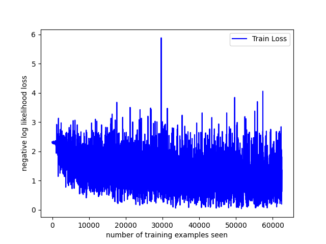
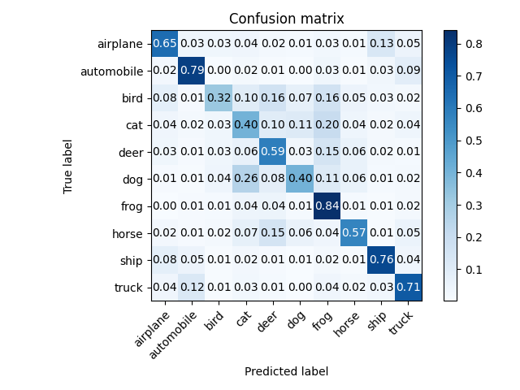

# SimpleCNN

I started working on AI related projects back in 2019. My main focus were CNN networks, how they work and how to train and test Models. I started with projects using obviously python and Pytorch but I have also done prototypes with Keras and Tensorflow.
My first projects were related to image classification (mnist, cifr10) but I went beyond and looked at models capable to perform speaker recognition / identification.
During this journey I collected information on how models and deep learning work and created a comprehensive PowerPoint on my personal blog ([Personal blog on deep learning](https://sites.google.com/site/gsarnotechboard/Downhome/deep-learning)).
Now why simplecnn. In all the pytorch projects I worked on, I noticed that for simple model training and testing there was a lot of boiler plate code required which could be easily wrapped up in a library and easily shared and reused. Although AI and Deep Learning are very complex subject actually the concept behind them is very simple. I felt like today despite libraries make it very easy to perform simple operation they are not yet meant for everybody (like me without all the deep knowledge on the subject).
The reason behind simple CNN is to bring simple coders today and tomorrow anybody to be able to build, train and test simple models without a lot of pytorch or the mathematics knowledge (even if only for academic reasons).
It would really be nice if somebody were to create a project similar to "scratch" for python to be able to work on AI models.

To do list:

The goal with the items below is for a python coder to be able to create, train and test models without a lot of pytorch knowledge.

- [x] Autogenerate model from csv
- [x] support CNNModel in code
- [x] Display accuracy and loss
- [x] Examples MNIST, CIFAR10
- [ ] Provide handling of data sets in the library 
- [ ] Support error functions and optimizers in the library. 
- [ ] Create use case based (e.g. image recognition, voice recognition) pretrained models.
- [ ] tackle transfer learning.

## Utility functions to simplify dealing with cnn networks. Powered by Pytorch

## Install packages
change "C:/Users/GiuseppeSarno/IdeaProjects" with the root of your project.

```
set PYTHONPATH=%PYTHONPATH%;C:/Users/GiuseppeSarno/IdeaProjects/SimpleCNN/
cd C:\Users\GiuseppeSarno\IdeaProjects\SimpleCNN
pip install -r ../../requirements.txt
```

## Model generation
In both the MNIST and CIFAR10 examples it is possible to build a CNN model using a common csv file 
and stack the layers of the desired model. The csv file only requires to provide what the user needs to know about the model 
(input size, stride ,paddings for each convolution and so on). Other things like the fully connected input size (or convolution output size) are automatically generated by the library. 

In "thetrainingnew.py" under the MNIST folder I also introduced a new way to programmatically create models as such it all can be run in a single python execution.

## Run the MNIST example from console & windows:

### Run the model Generation

In this example we will be using the following parameters:
input(image) size   = 28x28
dimension           = 2 (we are dealing with 2 dimension input)
channels            =1  (only grayscale is used)
batch size          =10 (number of inputs will go through the model at the same time) 
filename            = themodel.py (output filename)
inputfile           = model.csv (input file with model definition)

```
> python3 ./simplecnn/modelgen.py -i 28x28 -d 2 -c 1 -b 10 -f ./examples/mnist/themodel.py -v ./examples/mnist/model.csv
```

### Run the Training
```
> cd ./examples/mnist
> python3 thetraining.py
```
Output:
```
Train Epoch: 1 [0/60000 (0%)]   Loss/avg: 2.395239/2.395239
Train Epoch: 1 [6400/60000 (11%)]       Loss/avg: 1.123712/1.907594
Train Epoch: 1 [12800/60000 (21%)]      Loss/avg: 0.777390/1.434527
Train Epoch: 1 [19200/60000 (32%)]      Loss/avg: 0.646094/1.191016
Train Epoch: 1 [25600/60000 (43%)]      Loss/avg: 0.704663/1.036754
Train Epoch: 1 [32000/60000 (53%)]      Loss/avg: 0.431299/0.927583
..............................................
..............................................
Train Epoch: 5 [25600/60000 (43%)]      Loss/avg: 0.143671/0.159320
Train Epoch: 5 [32000/60000 (53%)]      Loss/avg: 0.211940/0.160901
Train Epoch: 5 [38400/60000 (64%)]      Loss/avg: 0.092523/0.161049
Train Epoch: 5 [44800/60000 (75%)]      Loss/avg: 0.093523/0.160512
Train Epoch: 5 [51200/60000 (85%)]      Loss/avg: 0.243839/0.159639
Train Epoch: 5 [57600/60000 (96%)]      Loss/avg: 0.073853/0.158468

Test set: Avg. loss: 0.0001, Accuracy: 9824/10000 (98%)

new maximum accuracy = 98.239998
savedirectory not null saving model.pth in ./results\model.pth
savedirectory not null saving optimizer.pth in ./results\optimizer.pth
Test loss/Acc 0.000066/98.239998
```
the following pictures are displayed:


### Run the test and validation:

`> python3 thetest.py`

Output:
```
Test set: Avg. loss: 2.3316, Accuracy: 1137/10000 (11%)


Test set: Avg. loss: 0.0657, Accuracy: 9834/10000 (98%)

Confusion matrix, without normalization

[[5885    2    5    0    2    3   16    1    5    4]
[   0 6688   34    1    4    0    2    8    5    0]
[   8   18 5855   12    8    0    3   37   16    1]
[   6    3   56 5983    0   31    1   19   18   14]
[   3   19    6    0 5765    0   13    5    4   27]
[   9    5    3   16    3 5333   20    3   25    4]
[  16    8    3    0   17   18 5842    0   14    0]
[   2   17   35    2   13    1    0 6172    1   22]
[  11   38   32   14   15   20   12    7 5666   36]
[  21   13    0   12   82   16    1   52   15 5737]]

```
the following picture is displayed:


## Run the CIFAR10 example

### Run the model Generation
```
In this example we will be using the following parameters:
input(image) size   = 32x32
dimension           = 2 (we are dealing with 2 dimension input)
channels            = 3  (RGB is used)
batch size          = 4 (number of inputs will go through the model at the same time)
filename            = themodel.py (output filename)
inputfile           = model.csv (input file with model definition)
```

`> python3 ./simplecnn/modelgen.py -i 32x32 -d 2 -c 3 -b 4 -f ./examples/cifar10/themodel.py -v ./examples/cifar10/model.csv`

## Run the training

```
> cd ./examples/cifar10
> python3 thetraining.py
```
Output:
```
Files already downloaded and verified
Train Epoch: 1 [0/50000 (0%)]   Loss: 2.326186
Train Epoch: 1 [40/50000 (0%)]  Loss: 2.304344
..........................................
..........................................
Train Epoch: 5 [49800/50000 (100%)]     Loss: 1.370805
Train Epoch: 5 [49840/50000 (100%)]     Loss: 0.616962
Train Epoch: 5 [49880/50000 (100%)]     Loss: 0.784681
Train Epoch: 5 [49920/50000 (100%)]     Loss: 1.301057
Train Epoch: 5 [49960/50000 (100%)]     Loss: 1.799423
```

the following picture is displaied:




### Run the test and validation:

`> python3 thetest.py`

Output:
```
Test set: Avg. loss: 2.3037, Accuracy: 943/10000 (9%)


Test set: Avg. loss: 1.1305, Accuracy: 6029/10000 (60%)

Normalized confusion matrix
[[0.647 0.033 0.033 0.037 0.017 0.012 0.028 0.013 0.132 0.048]
 [0.022 0.791 0.003 0.016 0.008 0.003 0.032 0.006 0.029 0.09 ]
 [0.079 0.011 0.322 0.1   0.161 0.073 0.161 0.05  0.025 0.018]
 [0.036 0.017 0.034 0.403 0.098 0.111 0.202 0.039 0.02  0.04 ]
 [0.033 0.01  0.034 0.064 0.587 0.031 0.152 0.058 0.017 0.014]
 [0.009 0.008 0.04  0.257 0.081 0.403 0.11  0.06  0.013 0.019]
 [0.002 0.01  0.012 0.043 0.045 0.012 0.841 0.013 0.006 0.016]
 [0.023 0.01  0.021 0.071 0.152 0.056 0.038 0.567 0.008 0.054]
 [0.08  0.049 0.007 0.024 0.011 0.005 0.018 0.007 0.762 0.037]
 [0.038 0.125 0.006 0.025 0.015 0.002 0.037 0.016 0.03  0.706]]
```
the following picture is displayed:



## The CNNModel class  (examples/mnist/thetrainingnew.py)

The CNNModel class is split in 2 sections (as 99% of the CNN networks)
the Convolution section and the Fully connected section.

init parameters (CNNModel (input channels, input size)

Note: the dimension of the network is calculated by using the input size.

Those are the layers (with parameters) supported today in the Convolution section:
Conv    (output,kernel,stride,padding)
MaxPool (kernel,stride,padding)
ReLU
Dropout (percentage)
BatchNorm

Those are ones allowed in the Fully connected section:
Linear    (output)
LogSoftMax
ReLU
Dropout
BatchNorm 

`> python3 thetrainingnew.py`


